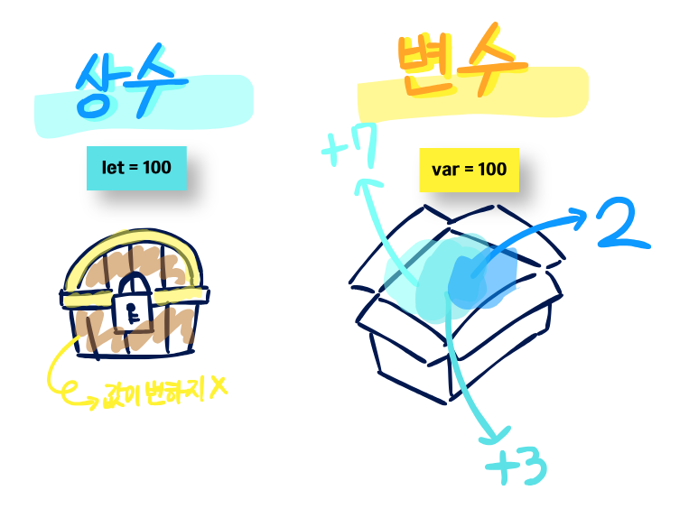

# 상수(let)와 변수(var)



이해하기 쉽게 위 그림으로 설명을 해보겠다 ‼️

## 상수란?
→ 상수란 보이는거와 같이 한 번 값을 할당하면 변경할 수 없는 데이터 저장되는 저장소, \
프로그램에서 변경하지 않는 값을 저장할 때 사용

```swift
let pi = 3.14159
// 상수 변수 let에 3.14159 저장

let pi = 3.14
// 나중에 바꾸려고하면 **에러발생** (바꾸려는 값은 상수 즉, 변하지 않은 수이기 때문에)
```

## 변수란?
→ 저장된 값을 변경할 수 있는 데이터 저장소, \
변수를 선언하고 값을 할당한 후, 필요할 때 값을 변경할 수 있음
```swift
var age = 1
// age에 1이 저장

var age = 5
// 이제 1이 아닌 5로 바뀜
```
.

.

.

.

.

👀 지정 형식!!

```swift
let 이름 : 타입 = 값
var 이름 : 타입 = 값
```

## 예시
나중에 할당하려고 하는 상수나 변수는 이렇게 적어야한다 ⬇️

```swift
let sum: Int
let inputA: Int = 100
let inputB: Int = 200

// 선언 후 첫 할당
sum = inputA + inputB

// sum = 1, ... 그 이후에는 다시 값을 바꿀 수 없음 (오류발생)

//변수도 물론 차후에 할당하는 것이 가능!
var chickenfeet: string

chickenfeet = "wave"

// 변수는 차후에 다시 다른 값을 할당해도 문제가 ❌
chickenfeet = "치이카와"